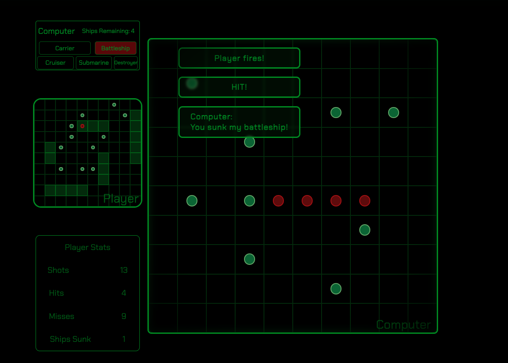

# Battleship

**Battleship** is a classic strategy guessing game that has been played worldwide for over a century. Though it's exact origins are unknown, it has evolved into various board games and digital versions.

 

>
Battleship, originally known as "Broadsides," is believed to have been first published as a pencil and paper game in the 1930s, though some say it was first played by Russians in the late 1800's.

It gained popularity during World War I and World War II and was eventually trademarked as "Battleship" by the Milton Bradley Company in the early 1960s. Over the years, it has become a classic game, played in various forms across the globe.

 

---

 

---
---
# [&#8680; Play Battleship! &#8678;](https://timhuitt.github.io/battleship/) &nbsp;&nbsp;&nbsp;Javascript &nbsp;&nbsp;&nbsp;|&nbsp;&nbsp;&nbsp; HTML &nbsp;&nbsp;&nbsp;|&nbsp;&nbsp;&nbsp; CSS

---
---
 

# Game Overview
  - **Players**: 2
  - **Game Board**: 10x10 grid
    - Rows: A - J
    - Columns: 1 - 10

## Game Setup
- Each player places five different ships on their own grid:
  1. Destroyer: 1 x 2 cells
  2. Submarine: 1 x 3 cells
  3. Cruiser: 1 x 3 cells
  4. Battleship: 1 x 4 cells
  5. Carrier: 1 x 5 cells

## Gameplay
- Players take turns guessing a single cell (e.g., G8) on the opponent's grid.
- A "shot" can either hit:
  1. An opponent's ship, resulting in a "hit."
  2. An empty cell, resulting in a "miss."

## Winning
- When all cells occupied by a ship are hit, the ship is "sunk."
- The first player to sink all of the opponent's ships wins the game.

---
 

## Completion Goals
* Add board switch animation
* Fade in/out messages
* Outline sunken ships

## Future Implementation Goals
- Smarter computer player
- A more diverse toast system
- Actual ships