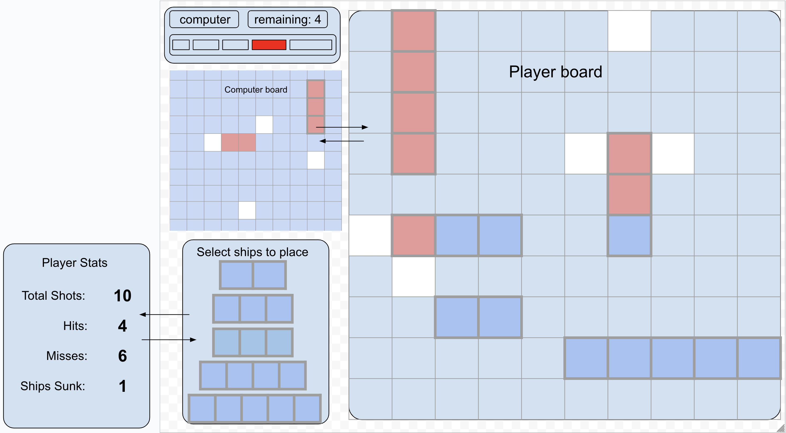
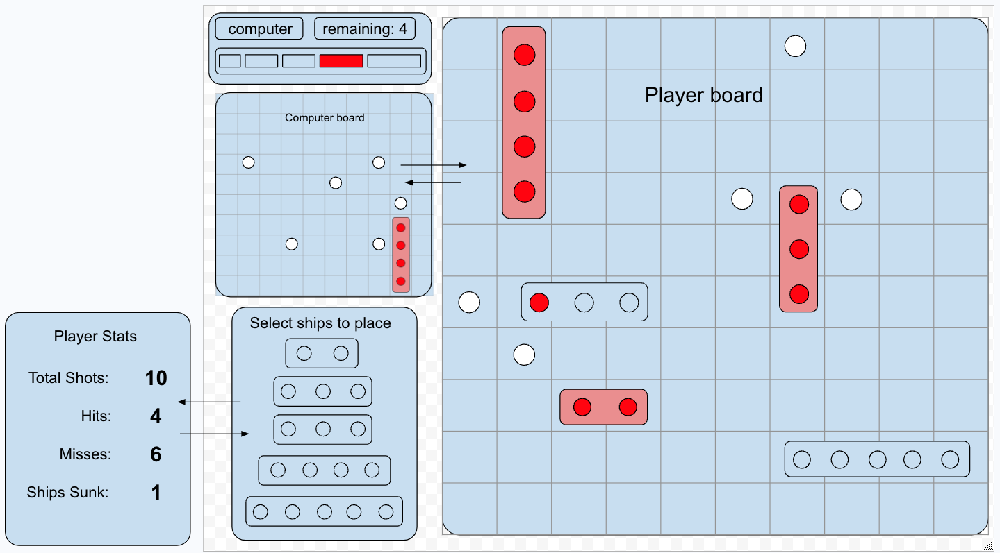

# Project: Battleship
* Initial Style

* Final Style (if time permits)

---
[View Psuedocode](./pseudocode.md)

---
## Gameplay
1. **Game Setup**
    * Player selects and places ships
2. **Player Turn**
    * Player select a cell on the computer board
        * Player hits or misses enemy ship
3. **Computer Turn**
    * Computer selects a cell on the player board
        * Computer hits or misses player ship
4. **Game End**
    * Game ends when one player has lost all of their battleships
---

## Requirements
- [ ] Render to browser
- [ ] Win/Loss logic and rendering
- [ ] Separate HTML/CSS/JS
- [ ] Vanilla JS
- [ ] Properly formatted (indentation/spacing)
- [ ] No unused code
- [ ] Sensible function/variable naming
- [ ] Consistent code structure
- [ ] Deployed on GitHub Pages
---
## Schedule
- [ ] 1. Friday/Saturday - Setup + UI

   - [ ] Project Setup (Github)
     - [ ] Add planning notes to planning.md
     - [ ] Create pseudocode.md document in docs folder and link in planning.md
     - [ ] Create static HTML / CSS / JS boilerplate

   - [ ] Build primary game board
     - [ ] Build dynamic elements (headings / labels)
     - [ ] Build interactive elements (buttons / radios)
     - [ ] Provide layout CSS

   - [ ] Stretch / Planning
     - [ ] Elaborate existing pseudocode to identify changes to the DOM
     - [ ] Experiment with audio playback (JS Sandbox)

- [ ] 2. Saturday/Sunday - Initial State + Render

   - [ ] Create & Display State
     - [ ] Identify DOM elements that will need to be updated
     - [ ] Create and set starting values for each state
     - [ ] Create render() and verify the DOM shows state in the browser

   - [ ] Invoke render() in init()
     - [ ] Create helper functions to control changes in state / browser

   - [ ] Manually update state to play the game (start -> end game)
     - [ ] Call helper functions() in the order they would be triggered
     - [ ] Testing may be manual (invoking them after init() or using the browser console
     - [ ] Verify the game can be played through manually

   - [ ] Stretch / Planning
     - [ ] Link your UI interactive elements to the handler functions
     - [ ] Research advanced CSS features for future development

- [ ] 3. Monday/Tuesday - Interactions + Advanced UI Updates

   - [ ] Link Interactive elements to callback functions (if not previously done)
     - [ ] Each handler will call one or more helper functions that will change state
     - [ ] After all helper functions execute, call the render() function
     - [ ] The user should see feedback about the game state after each interaction

   - [ ] Continue working on controller functions to account for game logic
     - [ ] Identify which state values determine a ‘game over’ 
     - [ ] Verify that the game can be played from start to ‘game over’
     - [ ] Implement a ‘game over’ message and play again option
     - [ ] Remove any non-restart related handlers
     - [ ] Reset the state if play again is selected.

   - [ ] Stretch: Begin building gameplay ‘quality of life’ features:
     - [ ] Start buttons
     - [ ] CSS Animations (Flip, Hide/Fade Effects)
     - [ ] Informational cards / discrete about pages to describe the rules of the game

- [ ] 4. Tuesday/Wednesday - Refine Gameplay + Stretch goals
   * Deploy application on Github

   - [ ] Testing local and deployed codebase
     - [ ] Verify MVP code runs without error start to finish
     - [ ] Verify no debugging console.logs appear in the deployed game

   - [ ] Add stretch goals from the feature list
     - [ ] Examples include (choosing one)
       - [ ] Refactors syntax to use classes
       - [ ] Add CSS Animations
       - [ ] Add an audio player
       - [ ] Create a scoreboard, storing top scores using localStorage
       - [ ] API call for expanded content

- [ ] 5. Wednesday/Thursday - Stretch goals + Additional Styling

   - [ ] Refinement of CSS + Stretch Features
   - [ ] Explore media queries + responsive layout changes
   - [ ] Customize header / body fonts
   - [ ] Add a color theme, image assets, icons

- [ ] 6. Thursday/Friday Final Day - Documentation

   - [ ] Provide a feature freeze at 10 PM EST the night before presentations

   - [ ] Review Documentation Guidelines and update Readme.md

   - [ ] Test code on GH pages to verify desired MVP functionality is present
